# Dorbel: an AI smart doorbell on the Arduino UNO Q

<p align="center">
  <a href="https://youtu.be/h4dxzuG-TlU">
    
  </a>
  <br>
  <em>▶ Click to watch the demo video on YouTube</em>
</p>

<p align="center">
  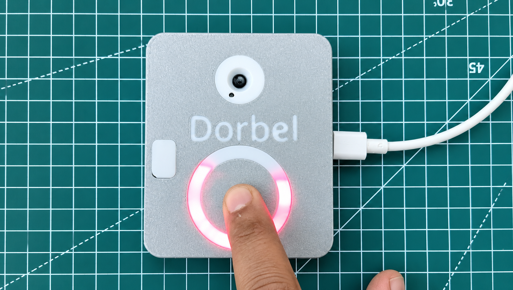
</p>

Dorbel is a private video doorbell that does all of its thinking at the edge. When a visitor presses the button, the door chimes and your phone gets a Telegram photo. A dashboard on your local network shows live video and lets you talk to the visitor. An AI model running on the board also spots people at the door, even when they don't ring.

| | |
|---|---|
| **Brain** | Arduino UNO Q (4 GB), running an Arduino App Lab app |
| **Camera, mic and speaker** | Seeed XIAO ESP32S3 Sense with a MAX98357A amplifier |
| **AI** | App Lab Video Object Detection brick with the YoloX nano model |
| **Alerts** | App Lab Telegram Bot brick |
| **Privacy** | Video and audio stay on your Wi-Fi. Only the alerts leave the house. |

The build is split into nine steps. Each step ends with a check, so make sure it passes before you move on. Pin tables, the I²C protocol, subsystem tests and the full troubleshooting list live in [docs/REFERENCE.md](docs/REFERENCE.md).

## Contents

1. [How it works](#1-how-it-works)
2. [Gather the parts](#2-gather-the-parts)
3. [Print the enclosure](#3-print-the-enclosure)
4. [Flash the XIAO](#4-flash-the-xiao)
5. [Wire the UNO Q](#5-wire-the-uno-q)
6. [Create the App Lab app](#6-create-the-app-lab-app)
7. [Add AI person detection](#7-add-ai-person-detection)
8. [Add the Telegram Bot brick](#8-add-the-telegram-bot-brick)
9. [Assemble, mount and test](#9-assemble-mount-and-test)
10. [Troubleshooting](#troubleshooting)
11. [How AI was used in this project](#how-ai-was-used-in-this-project)

<br>

## 1. How it works

<p align="center">
  
  
</p>

The UNO Q has two processors, and an App Lab app uses both of them.

| UNO Q side | What runs there | What Dorbel uses it for |
|---|---|---|
| **MCU** (STM32U585) | The app's **sketch** in `sketch/` | Button, RGB LED, I²C link to the XIAO |
| **MPU** (Qualcomm QRB2210, Debian Linux) | The app's **Python** code in `python/` and its **bricks** | Dashboard, AI, Telegram |

The two sides talk through the **Bridge**. The sketch publishes functions with `Bridge.provide_safe()` and Python calls them with `Bridge.call()`.

```
RING    button > UNO Q MCU > I²C > XIAO > chime on the door speaker
                     |
                     +> Bridge > Python > Telegram Bot brick > photo alert on your phone

VIDEO   XIAO camera > Wi-Fi > CameraHub (Python) +> dashboard (any number of viewers)
                                                 +> Video Object Detection brick (YoloX nano)
                                                       +> "person" > dashboard + phone alert

AUDIO   browser mic <> UNO Q dashboard <> Wi-Fi <> XIAO mic and speaker (push to talk)
```

One rule keeps the design simple: **I²C carries control and status, Wi-Fi carries video and audio.** The XIAO also reports its IP address over I²C, so the UNO Q finds the camera without any setup.

<br>

## 2. Gather the parts

<p align="center">
  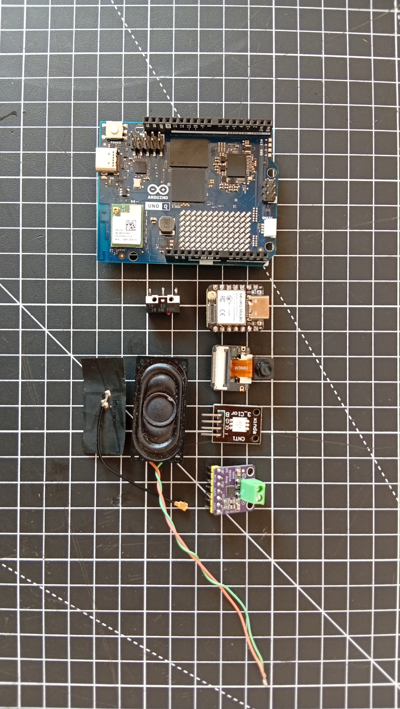
</p>

| Qty | Part | Role |
|:---:|---|---|
| 1 | Arduino UNO Q (4 GB) | System brain, runs the App Lab app |
| 1 | Seeed XIAO ESP32S3 **Sense** with the camera and mic board | Camera, microphone, Wi-Fi media |
| 1 | MAX98357A I2S amplifier | Drives the speaker |
| 1 | 8 Ω, 2 W speaker | Chime and the homeowner's voice |
| 1 | Momentary push button | The doorbell |
| 1 | RGB LED (common cathode) with 3 × 220 Ω resistors, or an RGB module | Status light |
| 2 | 4.7 kΩ resistors | I²C pull-ups |
| | Jumper wires, 2 USB-C data cables, PLA filament | |
| | 2.4 GHz Wi-Fi with internet, a phone with Telegram | |

<p align="center">
  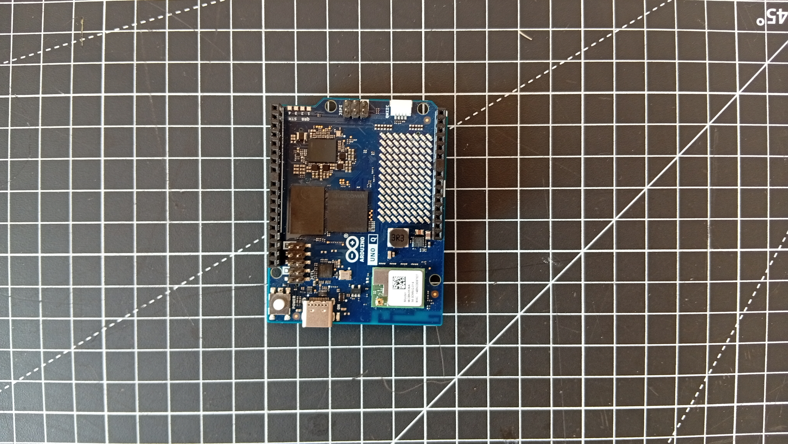
  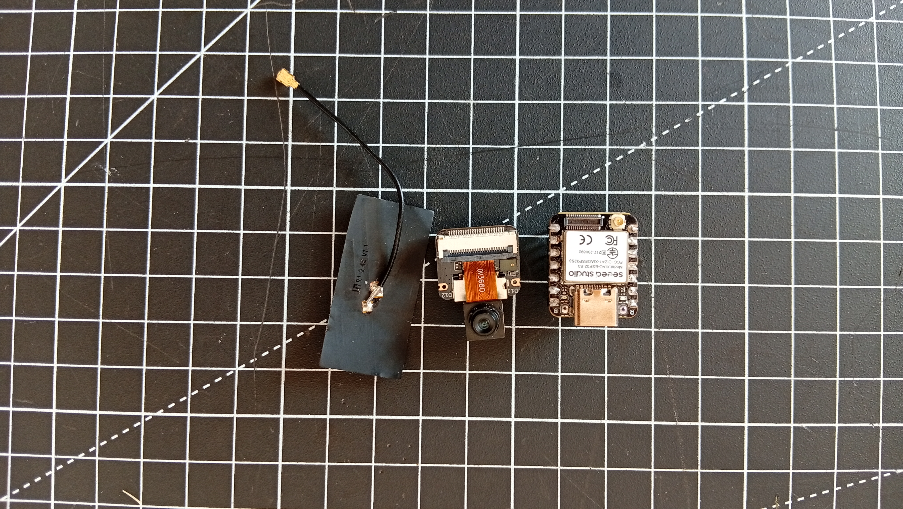
  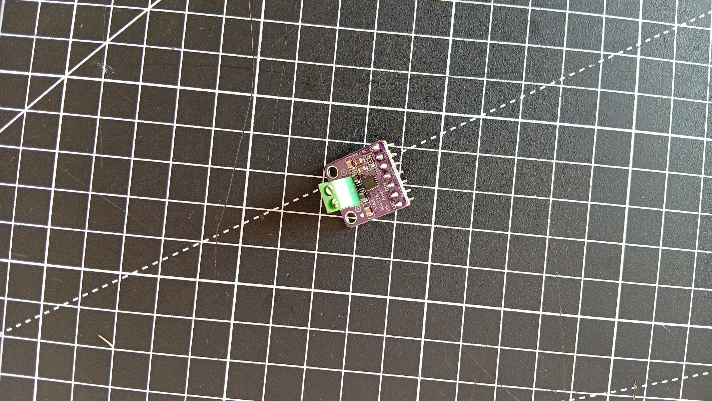
</p>
<p align="center">
  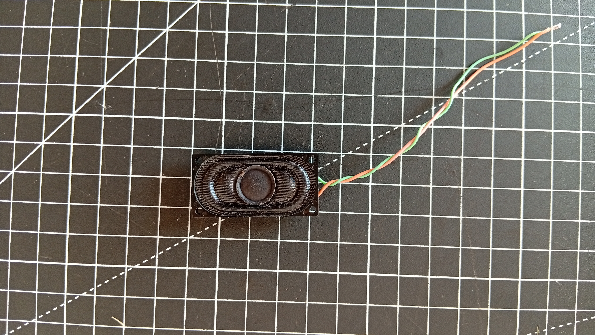
  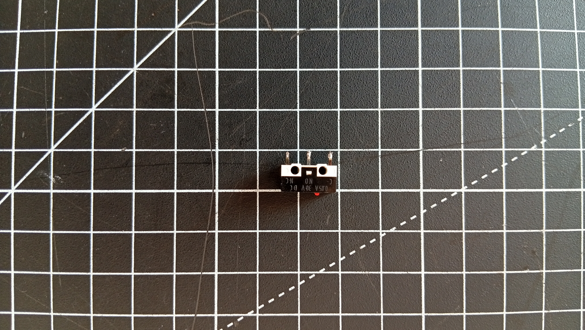
  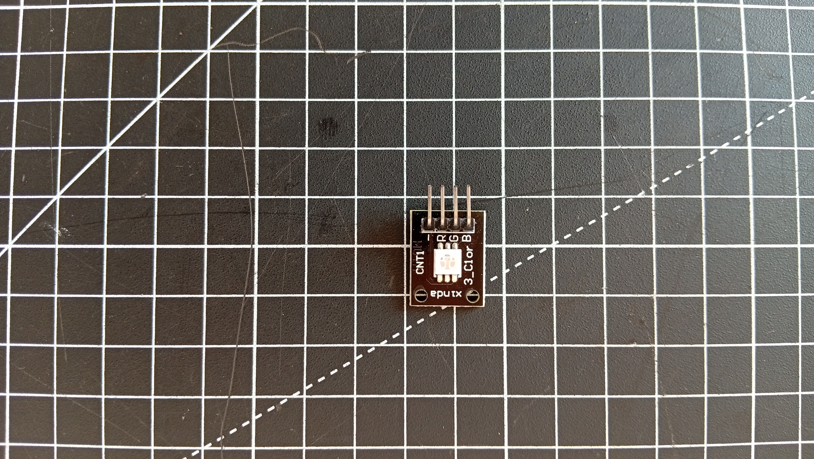
</p>
<p align="center"><sub>UNO Q · XIAO ESP32S3 Sense · MAX98357A · speaker · push button · RGB LED</sub></p>

**Software you need:** [Arduino App Lab](https://www.arduino.cc/en/software/) (already on the UNO Q), [PlatformIO](https://platformio.org/) on your PC for the XIAO, and Telegram on your phone.

<br>

## 3. Print the enclosure

<p align="center">
  
</p>

Print the four parts in the `stl/` folder.

| File | Part |
|---|---|
| `stl/Dorbel-Cover.3mf` | Front cover with the camera hole, light ring button and logo |
| `stl/Dorbel-Base.3mf` | Back shell that holds the electronics |
| `stl/Body2.stl` | Body |
| `stl/wall mount.stl` | Wall plate the doorbell slides onto |

<p align="center">
  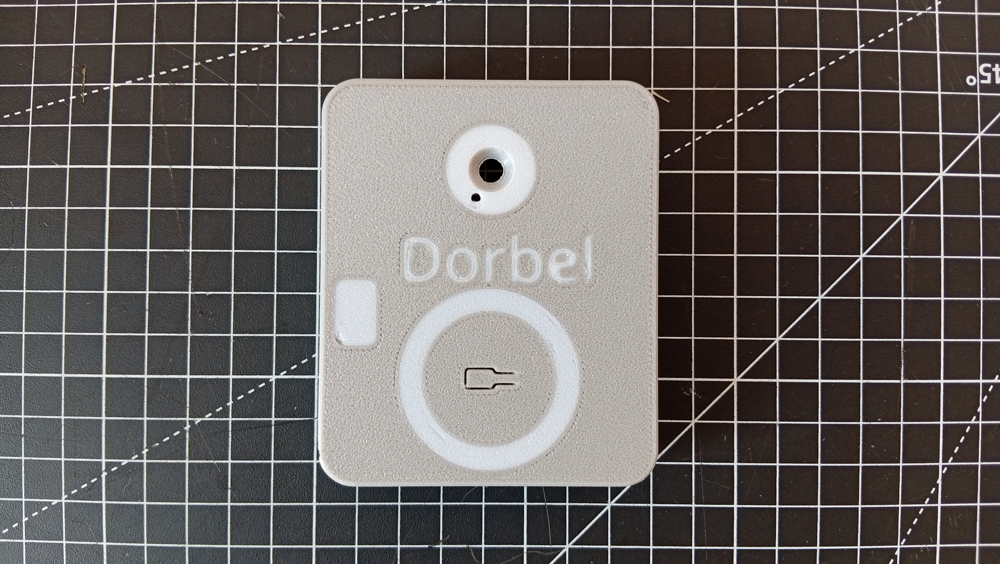
  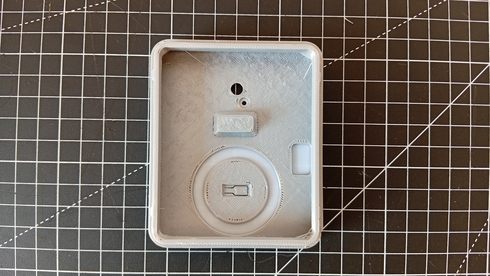
  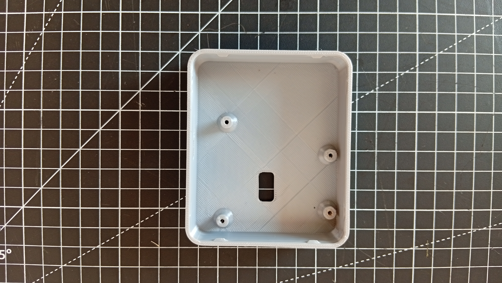
</p>

> **✅ Check:** the button moves freely inside the ring and the camera lens lines up with the front hole.

<br>

## 4. Flash the XIAO

The XIAO firmware is a PlatformIO project in `xiao/`. Open that folder in PlatformIO, not the repository root.

### 4.1 Wire the speaker

| XIAO pin | MAX98357A pin |
|---|---|
| D8 (GPIO7) | BCLK |
| D3 (GPIO4) | LRC |
| D1 (GPIO2) | DIN |
| 5V | VIN |
| GND | GND |

Connect the speaker between **SPK+ and SPK-**. Never connect SPK- to ground.

### 4.2 Add your Wi-Fi and flash

```bash
cd xiao
cp include/secrets.example.h include/secrets.h   # add your 2.4 GHz SSID and password
pio run -t upload
pio device monitor                               # 115200 baud
```

<p align="center">
  
  
</p>
<p align="center"><sub>The <code>xiao</code> project in VS Code with PlatformIO. <code>APP_MODE</code> picks what the XIAO runs.</sub></p>

Make sure `xiao/src/main.cpp` has `#define APP_MODE APP_MODE_DORBEL`, which is the default. The other `APP_MODE_*` values test one part at a time (speaker, mic, camera, I²C) and are described in the [reference](docs/REFERENCE.md#build-order-and-test-status).

<p align="center">
  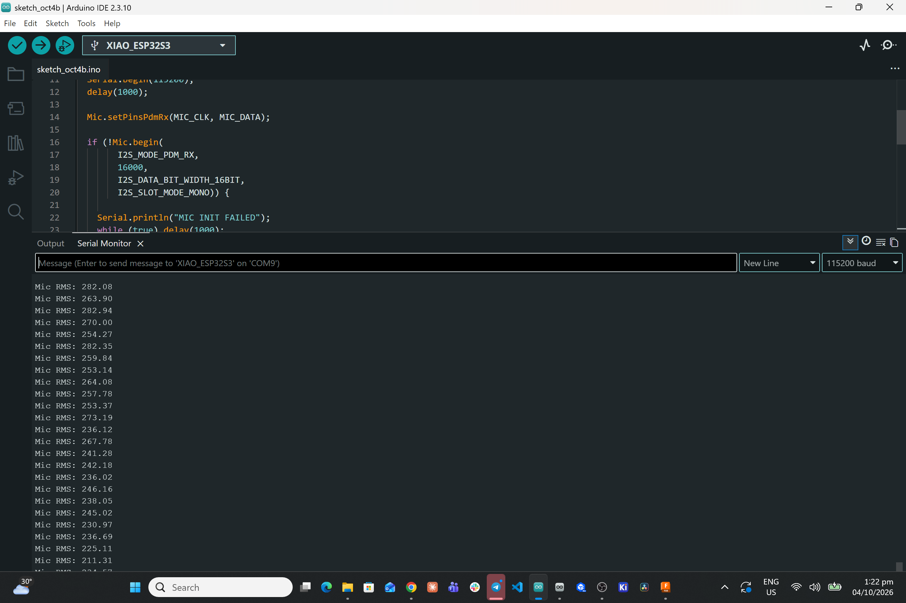
</p>
<p align="center"><sub>The mic level test, one of the single subsystem modes</sub></p>

> **✅ Check:** the serial log ends with a line like
> `WiFi up: camera http://192.168.x.y/  stream http://192.168.x.y:81/stream  intercom ws://192.168.x.y/audio`.
> Open `http://192.168.x.y/` on your PC to see the camera, then close the tab. The XIAO only streams to one client, and that slot belongs to the UNO Q.

<p align="center">
  
</p>

> **⚠️ Important:** the XIAO and the UNO Q must be on the **same 2.4 GHz network**. If they aren't, video, talk and photos all stop working.

<br>

## 5. Wire the UNO Q

| UNO Q pin | Connects to | Notes |
|---|---|---|
| D2 | Push button, other leg to GND | Uses `INPUT_PULLUP` |
| D3, D5, D6 | RGB red, green, blue through 220 Ω | Common cathode to GND |
| **A4** (SDA) | XIAO D4 | `Wire2` in the sketch, not the D20/D21 header |
| **A5** (SCL) | XIAO D5 | |
| GND | XIAO GND | The boards must share ground |
| 3.3 V | 4.7 kΩ to SDA and 4.7 kΩ to SCL | One pair of pull-ups for the whole bus |

The UNO Q is the I²C master and the XIAO is a slave at address `0x08`.

<p align="center">
  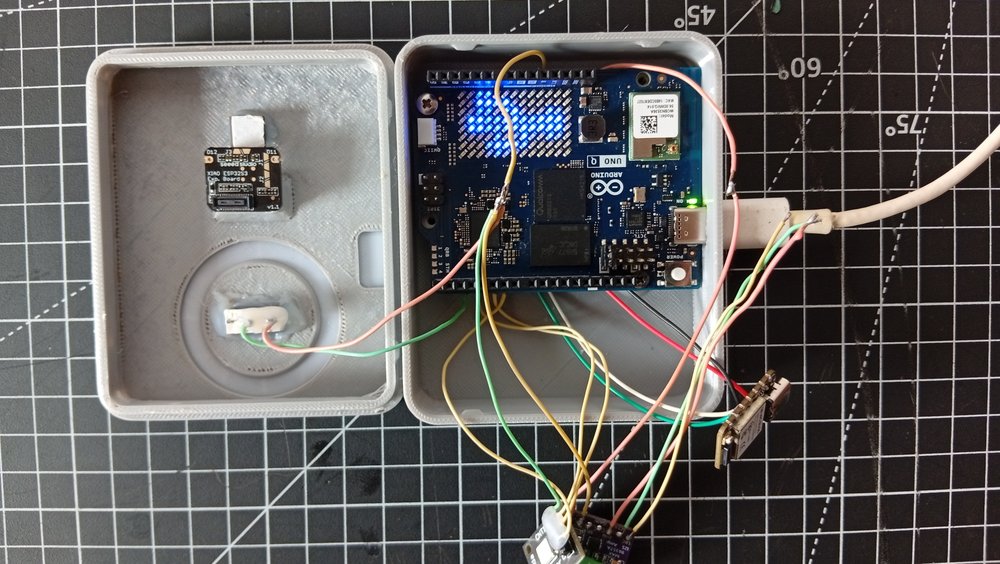
  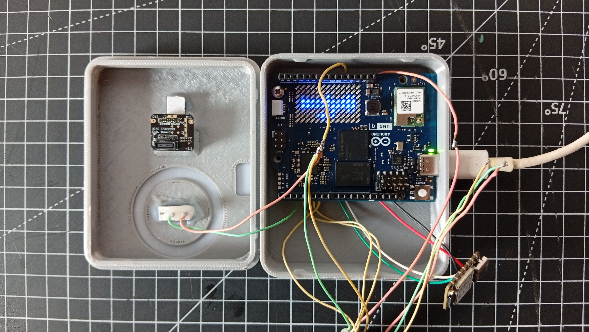
</p>

> **✅ Check:** once the app runs in step 6, the RGB LED shows the link state.

<p align="center">
  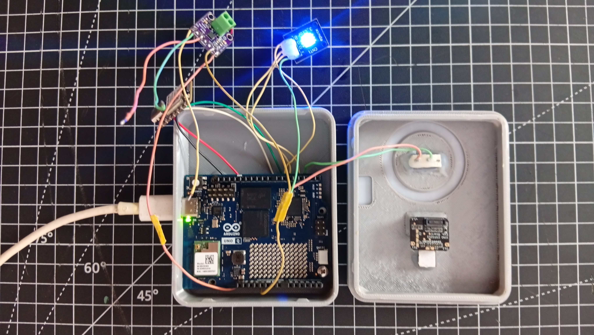
  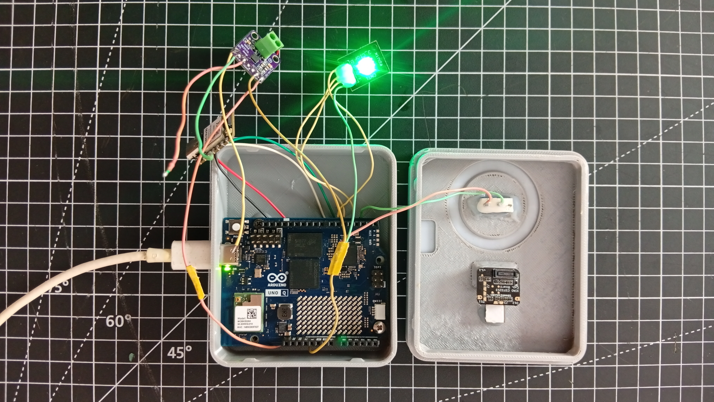
</p>
<p align="center"><sub>Blue means the XIAO is not answering on I²C · Green means idle and linked · Red means a ring was just sent</sub></p>

<br>

## 6. Create the App Lab app

In App Lab, an **app** is a folder inside `~/ArduinoApps/` with this layout:

```
app.yaml      name, icon, published ports and the bricks the app uses
sketch/       code for the MCU
python/       code for Linux, starting from main.py
```

Open App Lab on your PC. If it says **No boards found**, connect the UNO Q over USB or put it on the same network as your PC. Once the board shows up, App Lab opens on its **Apps** page, with **Examples** and **Inspirations** under *Learn and Explore* if you want to see how other apps are built.

<p align="center">
  
  
</p>

This repository is that folder. Open a terminal on the UNO Q (the board's desktop, `ssh arduino@<board>.local` or `adb shell`) and run:

```bash
cd ~/ArduinoApps
git clone https://github.com/Asongnabrilan-nso/dorbel.git dorbel
cd dorbel/python
cp dorbel_config_example.py dorbel_config.py      # local settings, kept out of git
hostname -I                                       # shows the UNO Q's IP address
```

In `python/dorbel_config.py`, set the dashboard address that the alerts will link to:

```python
DASHBOARD_URL = "https://192.168.x.z:8443/"      # the UNO Q IP from hostname -I
```

Go back to App Lab. **Dorbel 🔔** now shows on the **Apps** page. Open it to see the bricks, the files and the code, then click **Run**.

<p align="center">
  
</p>

When you click **Run**, App Lab will:

1. compile the sketch and flash it to the MCU (progress shows in the **App launch** tab),
2. start the app's bricks,
3. start `python/main.py` and show its output in the **Python** tab.

<p align="center">
  
  
</p>
<p align="center"><sub>Left: the sketch, with the app's bricks listed at the top. Right: <code>main.py</code> and the Python output.</sub></p>

### What the sketch does

`sketch/sketch.ino` debounces the button, sends `RING` to the XIAO over I²C, drives the LED and publishes four functions over the Bridge.

| Bridge function | Returns |
|---|---|
| `get_doorbell_state` | `1` if the button was pressed since the last clear |
| `clear_event` | Clears the press |
| `get_xiao_status` | XIAO status bits, or `-1` if it isn't answering |
| `get_xiao_ip` | The XIAO's IP address packed into a number |

`python/main.py` calls these four times a second and handles everything else.

> **✅ Check:** the **Python** tab shows these lines, and pressing the button plays the chime at the door.
>
> ```
> Dorbel dashboard: https://192.168.x.z:8443/
> [event] System started
> [event] MCU connected
> [event] XIAO online
> [event] Camera at 192.168.x.y
> [event] Camera reachable at 192.168.x.y
> ```

### Open the dashboard

Go to `https://<unoq-ip>:8443/` and accept the self-signed certificate the first time. You'll see live video, the system status and the push to talk button.

<p align="center">
  
  
</p>

The dashboard uses HTTPS because browsers only allow the microphone on secure pages. **Hold to talk** sends your voice to the door speaker and **Listen to door** plays the XIAO's microphone.

<br>

## 7. Add AI person detection

This step adds the **Video Object Detection** brick. It runs the YoloX nano model, which knows 80 everyday object classes including `person`, directly on the UNO Q. Camera frames never leave the board.

### 7.1 Add the brick

You can read about every brick in App Lab under **Bricks Manager > Bricks**. The **AI models** tab of Video Object Detection lists the models it can run.

<p align="center">
  
</p>

Add **Video Object Detection** to the app from the app's **Bricks** panel and keep the model *General purpose object detection, YoloX nano*. In `app.yaml` it looks like this:

```yaml
bricks:
- arduino:video_object_detection:
    model: yolox-object-detection
    devices:
    - remote_camera_0
```

The brick normally expects a USB camera. `remote_camera_0` tells App Lab the camera comes over the network instead, the same way the brick's smartphone camera example works.

### 7.2 Feed it the XIAO camera

The XIAO only serves one video stream at a time, so the dashboard and the AI can't each open their own. `python/camera_hub.py` reads the stream once and shares it.

- `CameraHub` keeps the newest frame and sends it to every dashboard viewer.
- `XiaoCamera` is an App Lab `BaseCamera` that gives the brick those same frames, as if a camera were plugged into the board.

```python
camera = CameraHub(current_xiao_ip)
detector = VideoObjectDetection(camera=XiaoCamera(camera), confidence=0.5, camera_preview=True)
```

### 7.3 React to people

`python/vision.py` registers an `on_detect_all()` callback, keeps only the `person` results, draws the boxes with App Lab's `draw_bounding_boxes()` helper and reacts once each time someone arrives.

```python
def on_detect_all(detections: dict, frame: bytes = None):
    people = detections.get("person", [])   # [{"confidence": 0.87, "bounding_box_xyxy": (...)}]
```

When a person arrives, Dorbel logs `AI: person detected at the door`, sets VISITOR to PRESENT and sends a Telegram photo (set up in step 8).

### 7.4 Tune it

These settings live in `python/dorbel_config.py`:

```python
PERSON_DETECTION = True        # turn the AI on or off
PERSON_CONFIDENCE = 0.5        # raise it if shadows count as people, lower it if people are missed
PERSON_ALERTS = True           # send a Telegram photo when a person arrives
PERSON_ALERT_INTERVAL_S = 120  # at most one person alert every 2 minutes
```

<p align="center">
  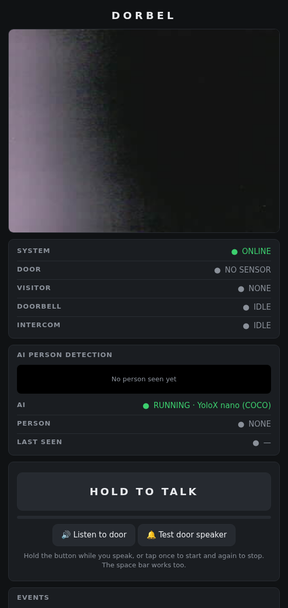
</p>

> **✅ Check:** run the app again. The **AI PERSON DETECTION** panel shows `RUNNING · YoloX nano (COCO)`. Step in front of the camera and you should see:
>
> - a `👤 PERSON 87%` badge on the live video,
> - your photo with a bounding box, the count and the confidence in the panel,
> - `AI: person detected at the door` in the event log.
>
> To watch the model work on its own, open the brick's preview page at `http://<unoq-ip>:4912`.

<br>

## 8. Add the Telegram Bot brick

### 8.1 Create the bot

In Telegram, open **@BotFather**, send `/newbot`, then choose a name and a username that ends in `bot`. BotFather gives you a **token** such as `123456789:AAH...`. Treat it like a password.

<p align="center">
  
</p>

### 8.2 Add the brick

In App Lab, add **Telegram Bot** from the **Bricks** panel. The brick requires a `TELEGRAM_BOT_TOKEN` variable. This repository is public, so `app.yaml` only holds a placeholder:

```yaml
- arduino:telegram_bot:
    variables:
      TELEGRAM_BOT_TOKEN: set-in-dorbel_config
```

Put your real token in `python/dorbel_config.py`, which git ignores:

```python
TELEGRAM_BOT_TOKEN = "123456789:AAH..."
```

If your copy of the project is private, you can paste the token into the brick's **Brick Configuration** instead.

### 8.3 What the bot does

The bot is set up in `python/notifier.py`:

```python
bot = TelegramBot(token=token)
bot.add_command("start",  register,   "Register for door alerts")
bot.add_command("photo",  send_photo, "Photo from the door camera")
bot.add_command("status", status,     "Dorbel system status")
bot.add_command("help",   help,       "What this bot can do")
```

| When | You get |
|---|---|
| Someone presses the doorbell | `🔔 DORBEL ALERT` with a 1600×1200 photo and the dashboard link |
| The AI sees a person arrive | `👤 Person at the door` with the photo and bounding box |
| You send `/photo` | A fresh full resolution photo |
| You send `/status` | MCU, XIAO, camera and AI status, plus when a person was last seen |

The brick polls Telegram for new messages, so you don't need a public IP, port forwarding or a webhook.

### 8.4 Register and approve users

Each homeowner opens the bot and taps **Start**. New users begin with alerts turned off, so a stranger who finds the bot gets nothing. Turn alerts on for each person on the dashboard's **Telegram users** page at `https://<unoq-ip>:8443/users`.

<p align="center">
  
</p>

> **✅ Check:** run the app. The **Python** tab shows `Telegram bot initialized successfully`. Press the doorbell and the approved phone gets a photo alert within a few seconds.

<p align="center">
  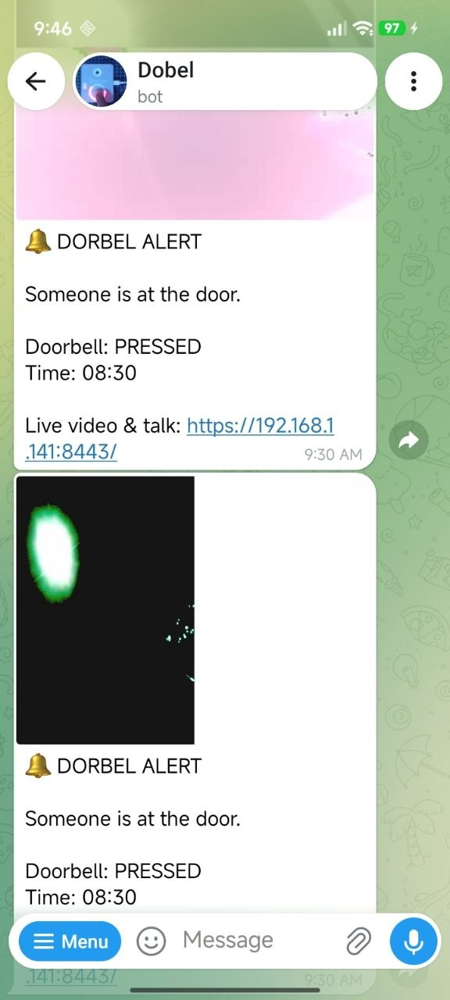
  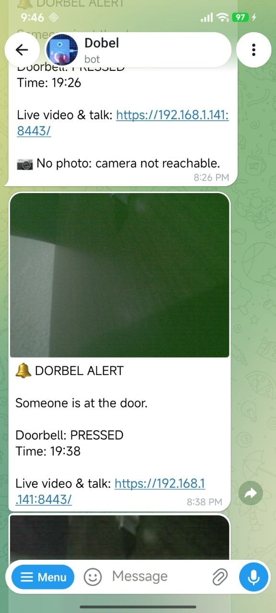
  
</p>
<p align="center">
  
</p>
<p align="center"><sub>The 1600×1200 photo that arrives with a ring alert</sub></p>

<br>

## 9. Assemble, mount and test

### 9.1 Fit the electronics

The RGB LED sits behind the light ring in the base. The XIAO and the button mount on the cover, with the camera behind the front hole.

<p align="center">
  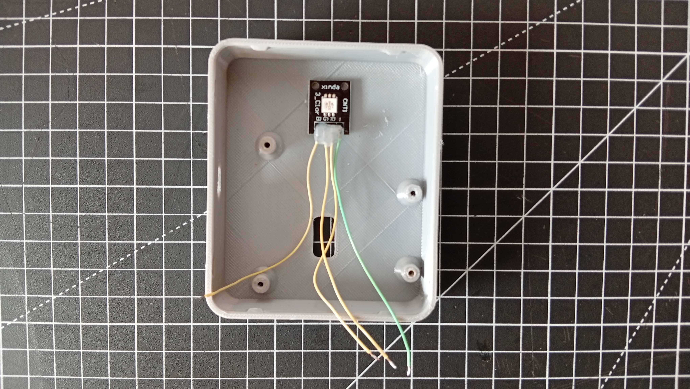
  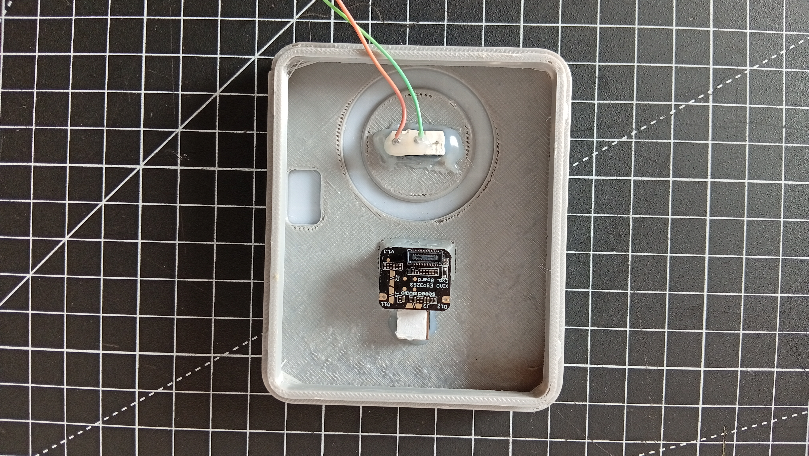
  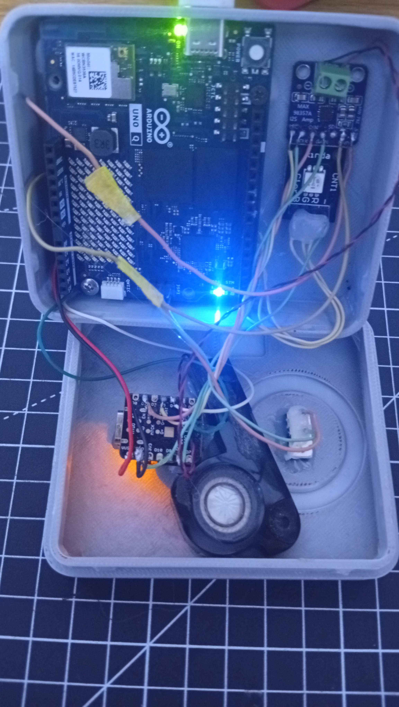
</p>

### 9.2 Close it up

Close the enclosure and check that the ring lights up through the cover.

<p align="center">
  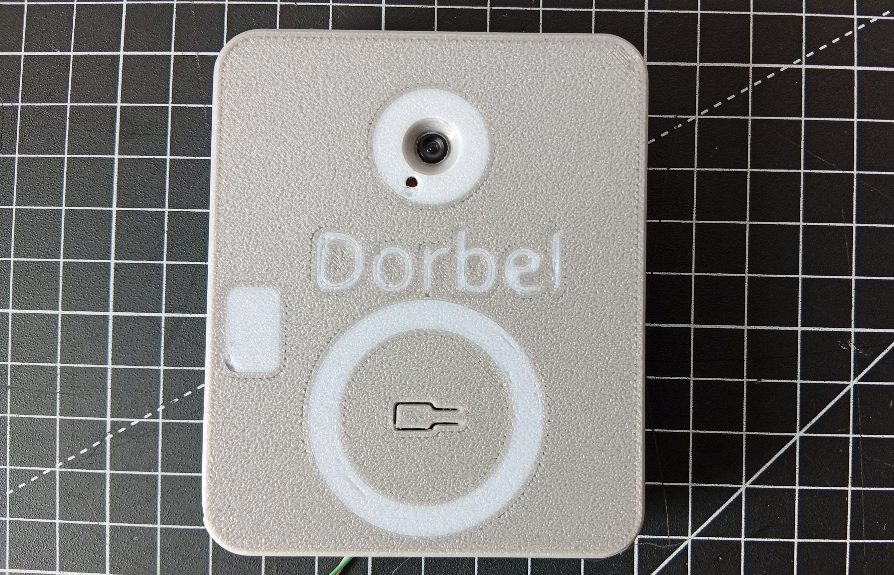
  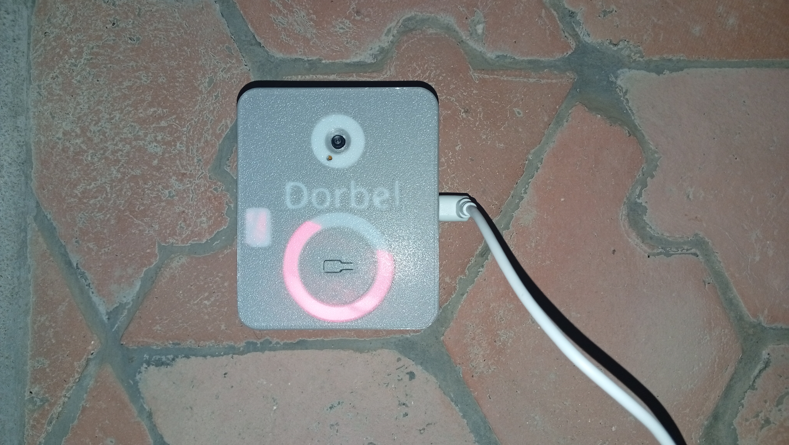
  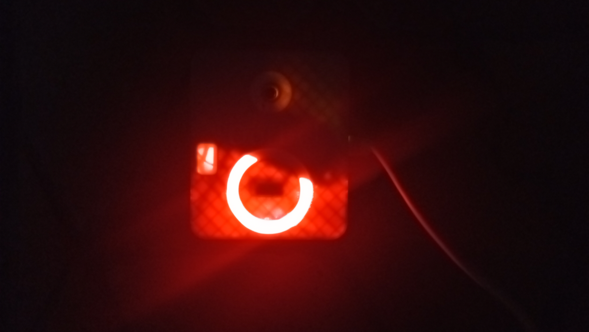
</p>

### 9.3 Mount it

Screw the wall plate next to the door, then slide the doorbell onto its hook.

<p align="center">
  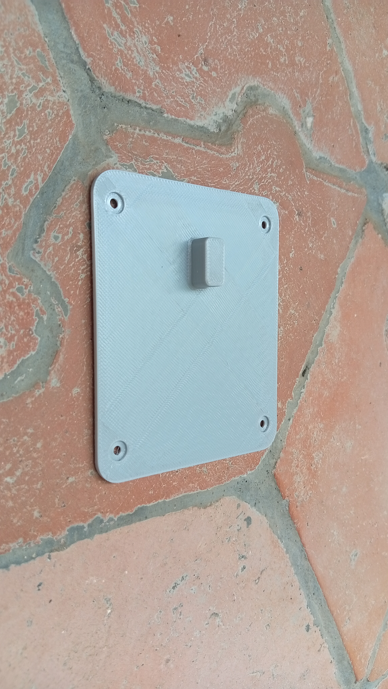
  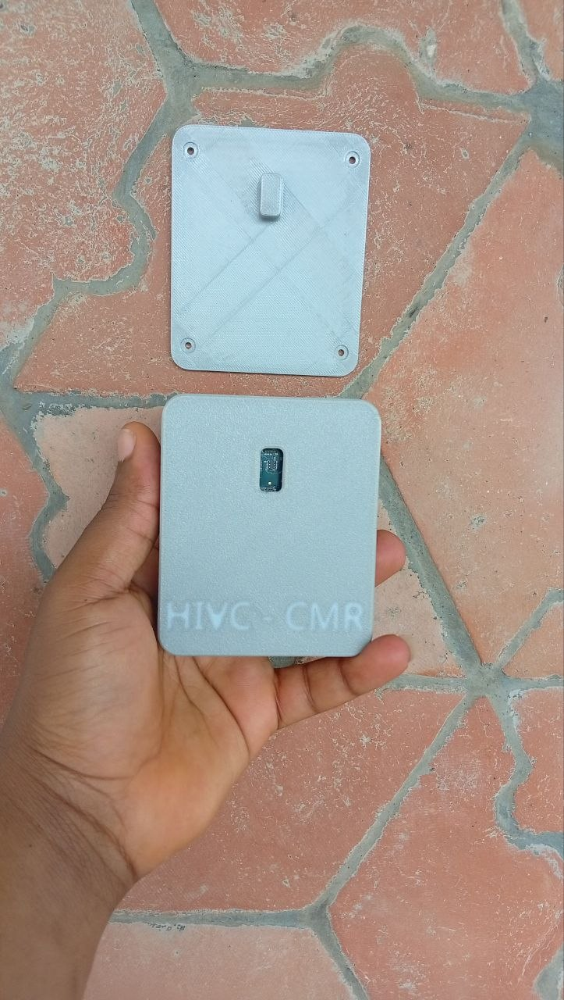
  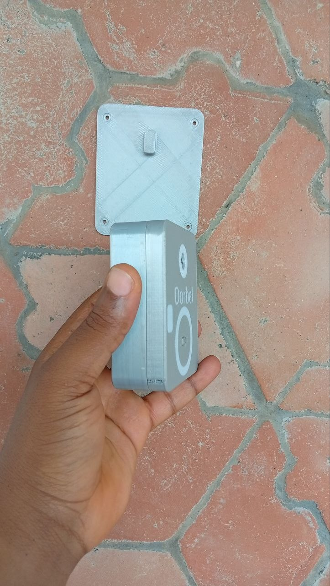
  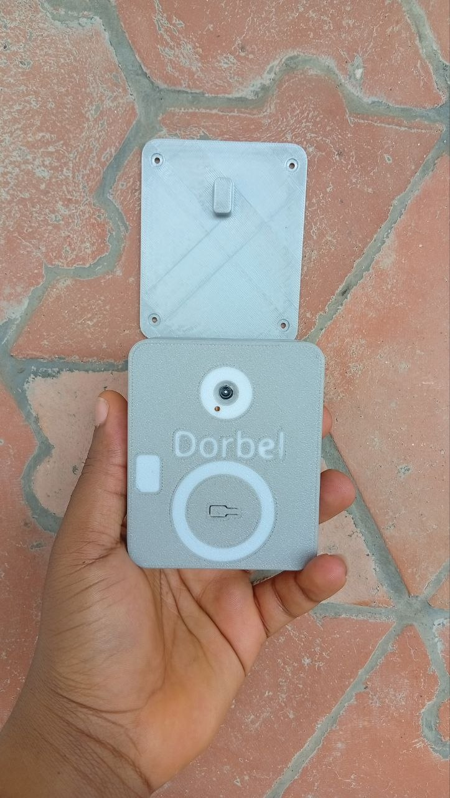
</p>

### 9.4 Test everything

- [ ] The **Python** tab shows `Camera reachable at <ip>` and `Telegram bot initialized successfully`
- [ ] The LED is green and the dashboard shows SYSTEM `ONLINE` with live video
- [ ] The AI panel shows `RUNNING`, and walking up brings a person badge, a boxed photo and a Telegram `👤` alert
- [ ] Pressing the button plays the chime, turns the LED red, shows DOORBELL `PRESSED` and sends a Telegram `🔔` photo
- [ ] **Test door speaker** plays two beeps and **Hold to talk** carries your voice to the door
- [ ] `/photo` and `/status` both reply in Telegram

<p align="center">
  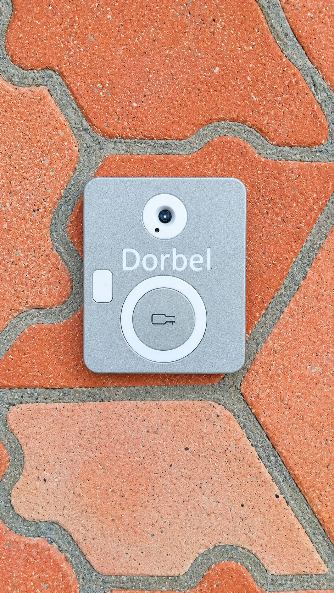
  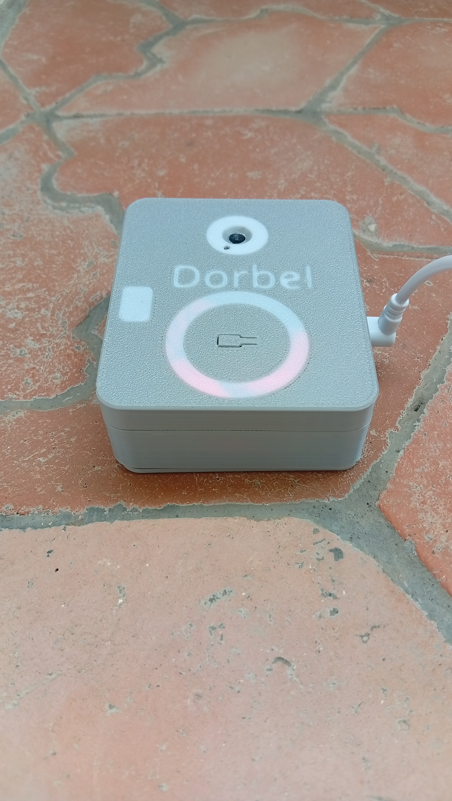
  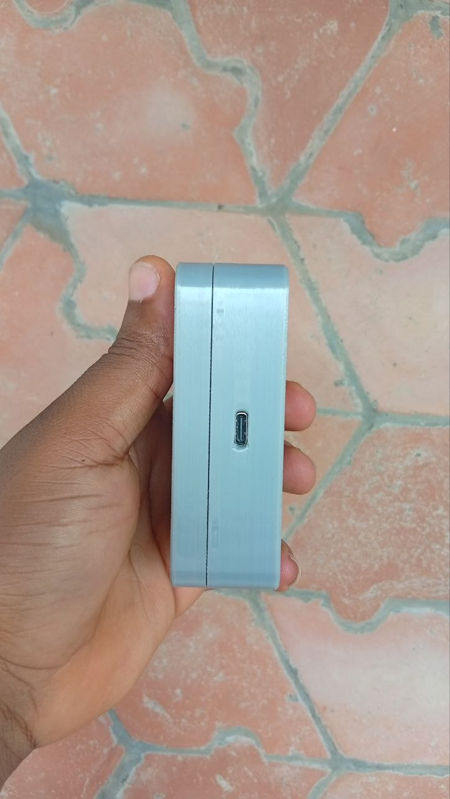
  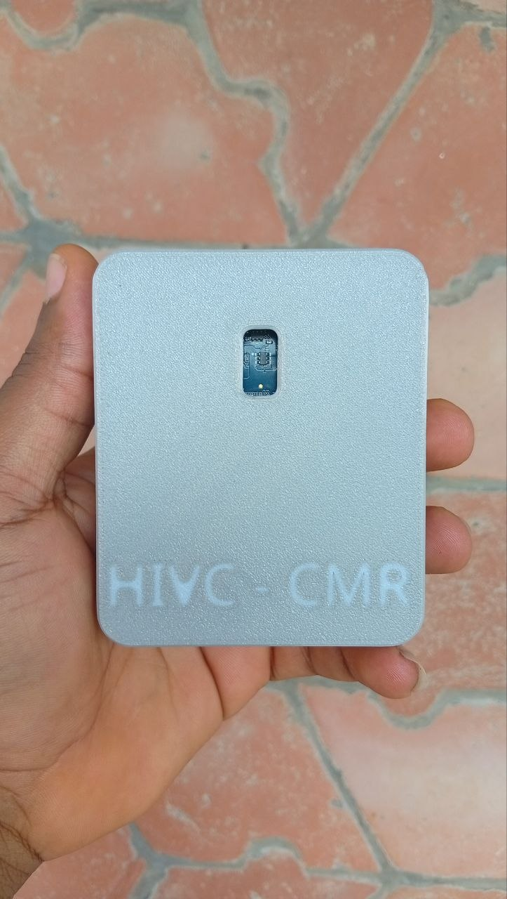
</p>

<br>

## Troubleshooting

| Problem | Fix |
|---|---|
| Video never loads, alerts have no photo, log says `NOT reachable` | The XIAO and UNO Q are on different networks. Put both on the same 2.4 GHz Wi-Fi. |
| LED is blue or SYSTEM shows `XIAO OFFLINE` | Check the I²C wiring: A4 and A5, shared GND, 4.7 kΩ pull-ups. The XIAO must run `APP_MODE_DORBEL`. |
| App Lab says `Variable "TELEGRAM_BOT_TOKEN" is required` | Keep the placeholder under `arduino:telegram_bot` in `app.yaml`. |
| The Python tab says `Telegram disabled` | The token is missing from `python/dorbel_config.py`. |
| No alerts and the log says `No enabled Telegram users` | Turn alerts on for the user on the `/users` page. |
| AI shows `WAITING FOR CAMERA` | Same cause as video not loading. |
| AI misses people or reacts to shadows | Lower or raise `PERSON_CONFIDENCE` and check how the camera is aimed. |
| Talk says the microphone needs the secure dashboard | Use `https://...:8443`, not `http://...:8000`. |

You'll find more problems and their causes in [docs/REFERENCE.md](docs/REFERENCE.md#troubleshooting).

<br>

## How AI was used in this project

### 1. AI running on the doorbell

Person detection is a neural network running on the UNO Q itself, with no cloud service involved.

| | |
|---|---|
| **Brick** | App Lab Video Object Detection (`arduino:video_object_detection`) |
| **Model** | YoloX nano, an object detector trained on the COCO dataset and packaged by Edge Impulse (`yolo-x-nano.eim`) |
| **Where it runs** | The brick's Edge Impulse model runner on the UNO Q's Linux side |
| **Input** | 320×240 frames from the XIAO camera, passed in through `XiaoCamera` |
| **What Dorbel uses** | `person` boxes and confidence, which drive the dashboard badge, the boxed snapshot, the VISITOR state and the Telegram alert |

I picked this model because it is App Lab's default general purpose detector for the UNO Q, it works out of the box and it returns bounding boxes that can be counted and drawn. The alternative, the *Person classification* model for the Video Image Classification brick, only answers "person or no person" for the whole frame. The brick also accepts custom Edge Impulse models, so a model trained for something like "parcel at the door" could replace YoloX later without code changes.

### 2. AI helping with the final integration

I designed and built Dorbel myself: the hardware, the enclosure, the XIAO firmware, the App Lab app and the testing of each subsystem on the bench. Once everything worked on its own, I used an AI coding assistant (Claude Code) to help put the final pieces together:

- adding the Video Object Detection brick and making it work with the XIAO's Wi-Fi camera instead of a USB camera, through the shared `CameraHub` and the `XiaoCamera` adapter,
- moving the Telegram alerts onto the official Telegram Bot brick and adding the `/photo`, `/status` and `/help` commands,
- adding the AI panel to the dashboard,
- checking the changes on the board by reading the app logs, and fixing the issues that came up,
- drafting this guide from my notes and photos.

Every change was tested on the real doorbell before it went in.

<br>

## Credits

The dashboard and Telegram flow follow [Q04 Trillo](https://gitlab.com/supermoderno/q04_trillo). The speaker wiring follows [Xiaozhi-for-XiaoESP32S3](https://github.com/TechTalkies/Xiaozhi-for-XiaoESP32S3).
